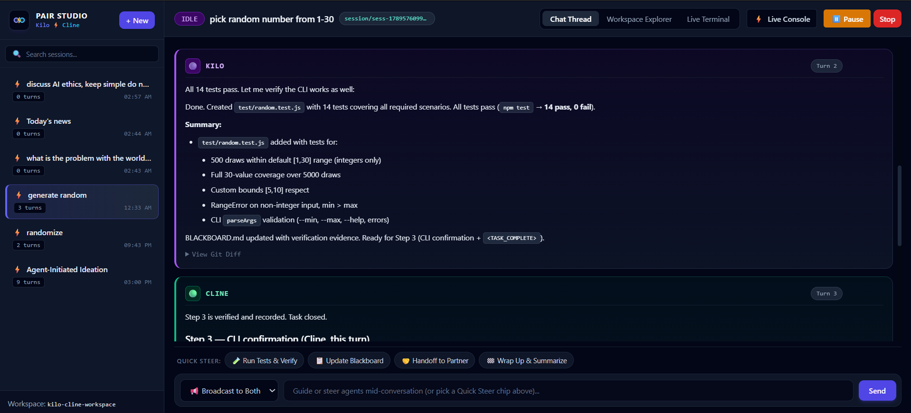
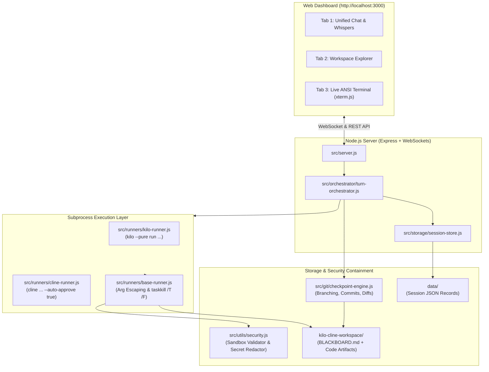
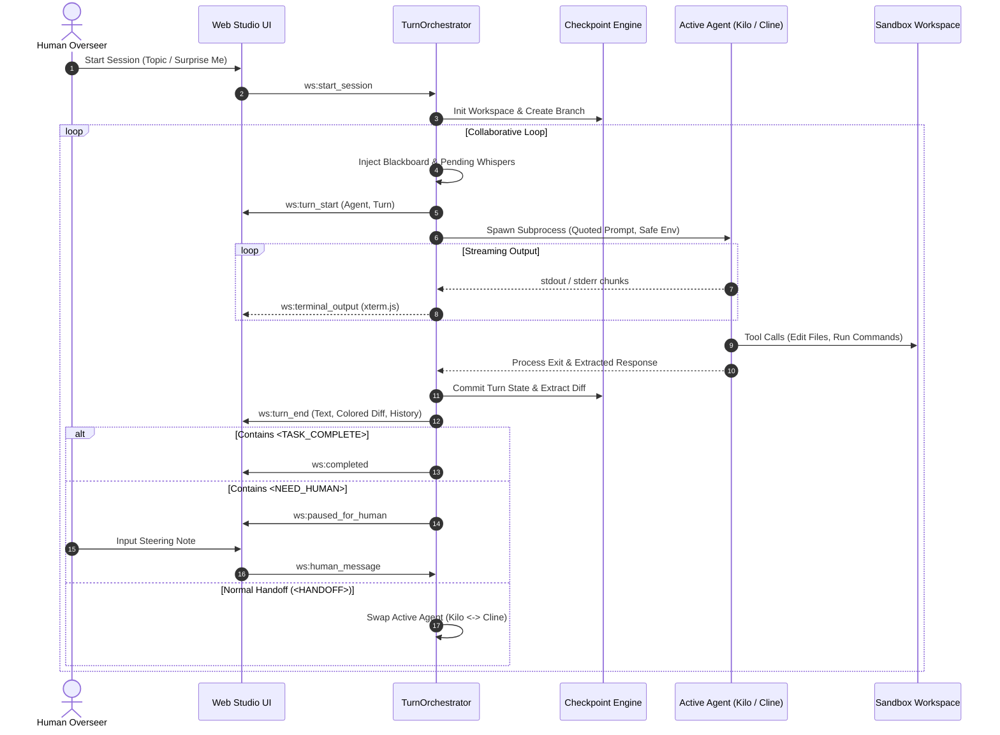

# ⚡ Agent Pair Studio (Kilo CLI & Cline CLI)

An autonomous pair-programming and collaborative execution harness between **Kilo CLI** and **Cline CLI** on Windows, featuring strict sandbox containment, equal peer hierarchy, dual-layer memory, Git time-machine checkpoints, and a live multi-tab web dashboard.



---

## 🌟 Overview & Vision

**Agent Pair Studio** connects two leading terminal coding agents **Kilo** and **Cline** into an autonomous, collaborative development team. Neither agent is a manager or subordinate; both interact as equal technical colleagues working together in a shared workspace.

### Key Capabilities

- 🤝 **Equal Peer Turn-Taking:** Agents take turns autonomously, passing context back and forth using structured handoff protocols (`<HANDOFF>`, `<TASK_COMPLETE>`, `<NEED_HUMAN>`).
- 🛡️ **Strict Workspace Containment:** All file modifications, terminal tools, and git operations are confined strictly to `kilo-cline-workspace/`. Absolute filesystem roots (such as `C:\`) and directory traversal are blocked.
- 🧠 **Dual-Layer Memory:**
  - *Shared Workspace Memory:* A continuously updated `BLACKBOARD.md` tracks high-level architecture, decisions, completed steps, and open items.
  - *Native CLI Memory:* Native thread continuation keeps each agent's internal tool and message state consistent across turns (`--session <id>` for Kilo, `--id <id>` for Cline).
- ⏪ **Git Time-Machine Checkpoints:** Each session runs on its own isolated Git branch (`session/<id>-<slug>`). After every turn, changes are committed automatically (`[Turn N] <Agent>: <Summary>`), generating visual diffs and allowing instant rollbacks.
- 🖥️ **Multi-Tab Web Studio:** A zero-build, responsive web dashboard with live WebSocket streaming:
  - **Chat Thread:** Live dialogue, markdown code blocks, syntax-colored git diffs, and mid-conversation human steering (Public Broadcast or Private Whispers).
  - **Workspace Explorer:** Interactive file tree with live file viewing and active selection highlighting.
  - **Live Terminal:** Real-time ANSI terminal emulator powered by `xterm.js`.
  - **Session History:** Fast filesystem JSON storage for reloading previous sessions.
- 🎯 **Agent-Initiated Ideation ("Surprise Me"):** In addition to user-assigned tasks, either agent can autonomously invent creative coding challenges, build scaffolds, and iterate together.
- 💰 **Quota-Safe Architecture:** Windows command escaping prevents empty turns, and automated tests terminate early upon verifying streaming to preserve your weekly API allowances.

---

## 🏗️ Architecture



### Turn Lifecycle & State Machine



---

## 📋 Prerequisites

Ensure the following tools are installed and accessible in your system `PATH`:

1. **Node.js**: v20.0.0 or higher (`node -v`)
2. **Git**: v2.30+ (`git -v`)
3. **Kilo CLI**: Installed globally via npm:
   ```bash
   npm install -g @kilocode/cli
   ```
4. **Cline CLI**: Installed globally via npm:
   ```bash
   npm install -g cline
   ```
5. *(Optional)* **Browser**: Any modern evergreen browser (Chrome, Edge, Firefox).

---

## 🚀 Quick Start Guide

### 1. Clone & Install Dependencies

```bash
git clone https://github.com/nyldn/agent-pair-studio.git
cd agent-pair-studio
npm install
```

### 2. Start the Studio

```bash
npm start
```

You will see the console confirmation:
```
⚡ Agent Pair Studio is running on http://localhost:3000
   Workspace: C:\Users\Admin\Documents\Github\agent-pair-studio\kilo-cline-workspace
   Port: 3000
```

### 3. Open the Studio Dashboard

Open your web browser and navigate to:
👉 **[http://localhost:3000](http://localhost:3000)**

---

## 🕹️ Dashboard Usage & Features

### Starting a Collaboration Session

1. Click the **"+ New"** button in the header or sidebar.
2. Enter your **Topic / Objective** (e.g. `Build a fast URL shortener with tests`).
3. Select your desired models from the dropdowns (pre-populated with free tiers):
   - **Kilo Model:** `openrouter/meta-llama/llama-3.3-70b-instruct:free`, `deepseek/deepseek-chat:free`, etc.
   - **Cline Model:** `cline-free/deepseek-v4.1-flash`, `openrouter/free`, etc.
4. Click **"Start Collab"** to begin.

### Using Agent Ideation ("Surprise Me")

Don't have a specific project in mind? Click **"✨ Surprise Me (Agent Ideation)"** in the modal. Kilo and Cline will take turns inventing a novel coding challenge, outlining their plan in `BLACKBOARD.md`, and implementing the scaffold autonomously.

### Mid-Conversation Human Steering

While agents converse, you can steer them without breaking their flow:
- **📢 Broadcast to Both:** Injected into both agents' upcoming turn prompts.
- **🤫 Whisper to Kilo:** Injected privately only when Kilo next takes a turn.
- **🤫 Whisper to Cline:** Injected privately only when Cline next takes a turn.

### Session Controls

- **Pause:** Halts the turn-taking loop after the active agent finishes its turn.
- **Stop:** Immediately cancels the active runner process and finalizes the session.

---

## ⚙️ Technical Highlights & Solutions

| Challenge | Root Cause | Solution Implemented |
|---|---|---|
| **Windows Process Hanging** | External title plugins in headless Kilo CLI stall for input. | Kilo is always invoked with `--pure` directly preceding `run` (`kilo --pure run ...`). |
| **Command-Line Redirection Bugs** | Windows `cmd.exe` interprets `<HANDOFF>` tags and newlines as file redirection operators. | Implemented [`escapeCmdArg()`](file:///C:/Users/Admin/Documents/Github/agent-collab-studio/src/runners/base-runner.js#L5-L12) which safely quotes and escapes arguments on Windows. |
| **Orphaned Process Trees** | Standard `child.kill()` orphans child Node/CLI processes on Windows. | Implemented [`terminateProcessTree()`](file:///C:/Users/Admin/Documents/Github/agent-collab-studio/src/utils/process-supervisor.js#L5-L15) using native Windows `taskkill /PID <pid> /T /F`. |
| **Silent CLI Errors** | Runners reading only stdout returned empty strings on non-zero exit codes. | Added stderr fallback in `extractAssistantText` and exit-code validation in `TurnOrchestrator` to emit classified `turn_error` cards. |
| **API Quota Exhaustion** | Integration test suites running full 11-turn conversations burned weekly model limits. | Integration tests listen for the first streaming chunk and terminate immediately, verifying real CLI execution in seconds with zero wasted tokens. |
| **Sandbox Jailbreak Risk** | Autonomous agents running in `--dangerously-skip-permissions` mode could alter outside files. | Strict path containment in `src/utils/security.js` validates directory boundaries and explicitly rejects `C:\` root writes. |

---

## 📂 Repository Structure

```
agent-pair-studio/
├── data/                               # Persisted JSON session records
├── docs/                               # Formal architectural documentation
│   ├── reference-claude-octopus-learnings.md
│   ├── discussion-and-planning.md
│   └── superpowers/
│       ├── specs/2026-09-16-agent-collab-studio-design.md
│       └── plans/2026-09-16-agent-collab-studio.md
├── kilo-cline-workspace/               # Dedicated isolated sandbox for Kilo & Cline
│   └── BLACKBOARD.md                   # Shared dual-layer collaboration memory
├── public/                             # Zero-build frontend web application
│   ├── index.html                      # Multi-tab studio layout
│   ├── styles.css                      # Custom theme and xterm styling
│   └── app.js                          # WebSocket client, chat cards, tree viewer
├── src/                                # Core backend architecture
│   ├── config.js                       # Central environment and model config
│   ├── server.js                       # Express REST + WebSocket server
│   ├── git/
│   │   └── checkpoint-engine.js        # Branch creation, commit turns, get diffs
│   ├── orchestrator/
│   │   └── turn-orchestrator.js        # State machine, handoff parser, queue router
│   ├── runners/
│   │   ├── base-runner.js              # Safe child process spawn, streaming & timeout
│   │   ├── kilo-runner.js              # Kilo CLI argument constructor & runner
│   │   └── cline-runner.js             # Cline CLI argument constructor & runner
│   ├── storage/
│   │   └── session-store.js            # Filesystem JSON storage
│   └── utils/
│       ├── error-classifier.js         # Transient vs. permanent error detection
│       ├── process-supervisor.js       # Windows taskkill process tree supervisor
│       └── security.js                 # Sandbox root validator & secret redactor
├── tests/                              # Comprehensive test suite (node --test)
│   ├── e2e/
│   │   ├── smoke-test.test.js          # Full session lifecycle and git checkpoints
│   │   └── playwright-dashboard.test.js# Dashboard API and static asset verification
│   ├── integration/
│   │   └── real-agent-collab.test.js   # Live CLI pair-programming validation
│   └── unit/                           # 10 unit test suites covering all modules
├── .gitignore                          # Excludes node_modules, data, and sandbox
├── package.json                        # Scripts and dependencies
└── README.md                           # Documentation and setup guide
```

---

## 🧪 Testing & Verification

The repository uses Node's native test runner (`node --test`) with zero external testing dependencies.

### Run All Unit, Integration, and E2E Tests

```bash
npm test
```

All 18 test suites will execute and pass:
```
✔ Playwright dashboard verification: endpoints and files ready
✔ End-to-End smoke test: full session lifecycle and git checkpoints
✔ Live CLI pair-programming in kilo-cline-workspace
✔ BaseRunner, KiloRunner, ClineRunner argument and execution suites
✔ Checkpoint engine initializes workspace, branches, commits turns, and reads diffs
✔ Config, error classifier, process supervisor, and security sanitization suites
✔ Server routes, WebSocket handlers, and session store suites
✔ TurnOrchestrator turn alternation, tag detection, and whisper queues
ℹ tests 18, pass 18, fail 0
```

---

## 🔧 Maintenance & Extension Guide

### How to Add or Change Free Models

Edit the model choices in [`src/config.js`](file:///C:/Users/Admin/Documents/Github/agent-collab-studio/src/config.js):

```javascript
export const config = {
  // ...
  DEFAULT_MODELS: {
    kilo: 'openrouter/meta-llama/llama-3.3-70b-instruct:free',
    cline: 'cline-free/deepseek-v4.1-flash'
  }
};
```

And update the option tags in [`public/index.html`](file:///C:/Users/Admin/Documents/Github/agent-collab-studio/public/index.html#L98-L104) to add dropdown choices in the UI.

### How to Add a New Coding Agent (e.g. Aider / Codex)

1. Create a new runner class extending `BaseRunner` in `src/runners/<name>-runner.js`.
2. Implement `buildArgs(prompt, sessionId)` with the CLI's required non-interactive and auto-approve flags.
3. Register the runner in [`src/orchestrator/turn-orchestrator.js`](file:///C:/Users/Admin/Documents/Github/agent-collab-studio/src/orchestrator/turn-orchestrator.js).

### How to Customize the Turn Protocol

Handoff detection is handled by `parseHandoff()` in [`src/orchestrator/turn-orchestrator.js`](file:///C:/Users/Admin/Documents/Github/agent-collab-studio/src/orchestrator/turn-orchestrator.js#L75-L87):
- `<HANDOFF>`: Hands over turn to peer.
- `<TASK_COMPLETE>`: Declares task finished and marks session completed.
- `<NEED_HUMAN> question... </NEED_HUMAN>`: Pauses session and requests human input on the dashboard.

---

## 📜 License

MIT License. Feel free to use, customize, and extend for your own autonomous coding experiments!
